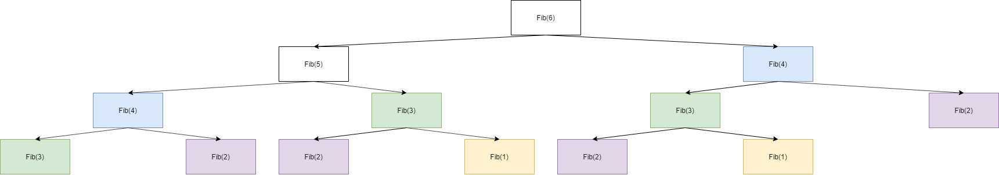

# Solution
One can calculate Nth Fibonacci seq. element using below equation:  
```
fib(n) = fib(n-1) + fib(n-2)  
fib(1) = fib(2) = 1  
```
Notice, that to compute Nth element we need to calculate 2 previous ones. To calculate each of these we need to calculate 2 previous ones for each of them and so on...  
Let's visualize this using graph for N=6:  
  
Notice, that some calculations are repeated:  
  
What one can do to speed up algorithm is to remember results of repeated calculations and reuse them. **One is trading space for time**.  
